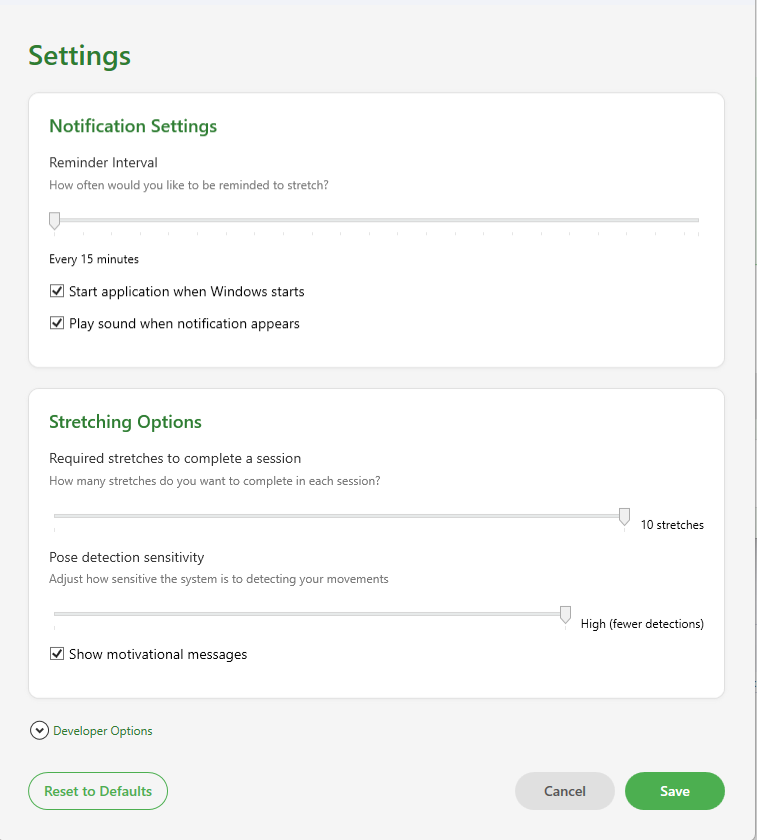
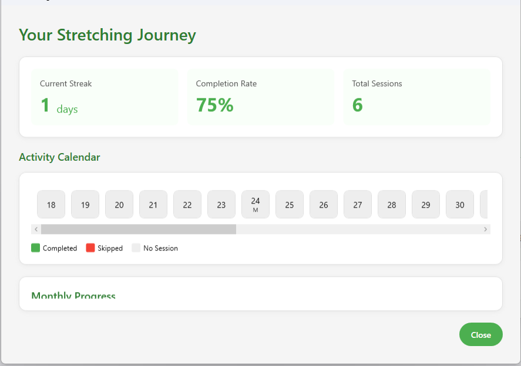

# Features & Interface

Stretch Tracker App provides a clean, intuitive interface designed to help you maintain healthy stretching habits with minimal disruption to your workflow.

## Main Window

The main window provides at-a-glance information about your stretching habits:

- **Quick status overview**: See your current streak and completion rate
- **Last stretch information**: Know when you last completed a stretching session
- **Start manual stretch**: Begin a stretch session whenever you want
- **Access to settings**: Customize the app to your preferences

## Settings

Customize every aspect of the app through the settings panel:

- **Reminder frequency**: Set how often you want to be reminded to stretch
- **Required stretches**: Adjust how many stretches are required to complete a session
- **Pose detection sensitivity**: Fine-tune how the app detects your movements
- **Startup options**: Configure the app to launch when your system starts
- **Notification settings**: Control how and when you receive reminders

## AI-Powered Stretch Detection

{: .note-title }
> Computer Vision & Machine Learning
>
> Our stretch detection system combines two powerful technologies to ensure accurate verification of your stretching movements:
> - **OpenCvSharp4**: For real-time motion analysis
> - **TensorFlow.NET**: For pose estimation and movement classification

{: .highlight }
> **Technology Highlight**
>
> The app's intelligent detection system can distinguish between genuine stretching movements and regular activity, ensuring you get credit only for actual stretches.

The stretch detection window uses your webcam to:

- **Verify stretching movement**: Uses computer vision algorithms to ensure you're actually stretching when prompted
- **Track progress**: Show how many stretches you've completed in the current session
- **Provide real-time feedback**: Display motion detection data and stretching confirmation
- **Auto-calibration**: Automatically adjust to your environment and lighting conditions

### Advanced Detection Features

Our AI-powered detection system includes:

1. **Intelligent Motion Analysis**
   - Distinguishes between stretching and other movements
   - Filters out background motion and noise
   - Adapts to your unique movement patterns

2. **Pose Recognition** (Machine Learning)
   - Identifies specific body positions and joint angles
   - Validates stretches against reference models
   - Provides guidance on proper stretching form

3. **Adaptive Learning**
   - Improves detection accuracy over time
   - Adjusts to your specific stretching style
   - Optimizes for your workspace environment

## Statistics & Progress

The statistics dashboard helps you track your stretching habits over time:

- **Completion rates**: See what percentage of Stretch Trackers you complete
- **Streaks**: Track your longest streak of consecutive completed stretches
- **Daily and weekly trends**: Identify patterns in your stretching habits
- **Session duration**: Monitor how long your stretching sessions typically last
- **Data export**: Export your stretching data for personal analysis