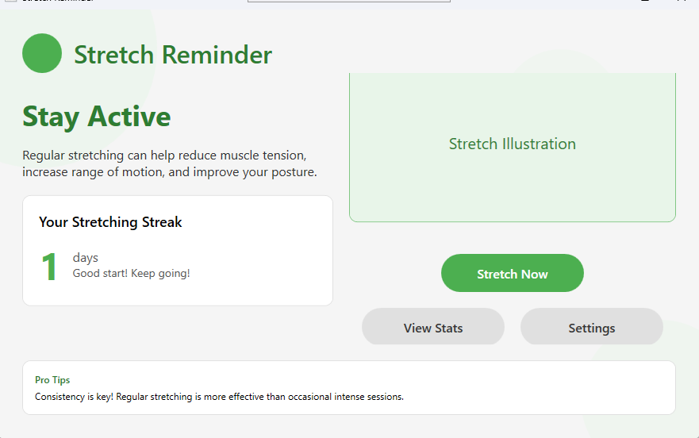

# Features & Interface

Stretch Reminder App provides a clean, intuitive interface designed to help you maintain healthy stretching habits with minimal disruption to your workflow.

## Main Window

The main window provides at-a-glance information about your stretching habits:

- **Quick status overview**: See your current streak and completion rate
- **Last stretch information**: Know when you last completed a stretching session
- **Start manual stretch**: Begin a stretch session whenever you want
- **Access to settings**: Customize the app to your preferences

## Settings

Customize every aspect of the app through the settings panel:

- **Reminder frequency**: Set how often you want to be reminded to stretch
- **Required stretches**: Adjust how many stretches are required to complete a session
- **Pose detection sensitivity**: Fine-tune how the app detects your movements
- **Startup options**: Configure the app to launch when your system starts
- **Notification settings**: Control how and when you receive reminders

## Stretch Detection

The stretch detection window uses your webcam to:

- **Verify stretching movement**: Ensure you're actually stretching when prompted
- **Track progress**: Show how many stretches you've completed in the current session
- **Provide real-time feedback**: Display motion detection data and stretching confirmation
- **Auto-calibration**: Automatically adjust to your environment and lighting conditions

## Statistics & Progress

The statistics dashboard helps you track your stretching habits over time:

- **Completion rates**: See what percentage of stretch reminders you complete
- **Streaks**: Track your longest streak of consecutive completed stretches
- **Daily and weekly trends**: Identify patterns in your stretching habits
- **Session duration**: Monitor how long your stretching sessions typically last
- **Data export**: Export your stretching data for personal analysis