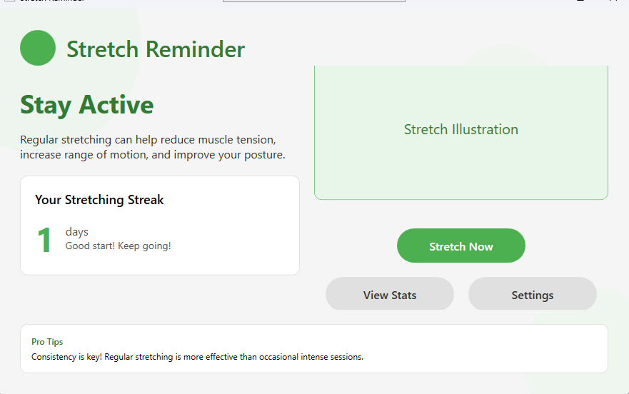
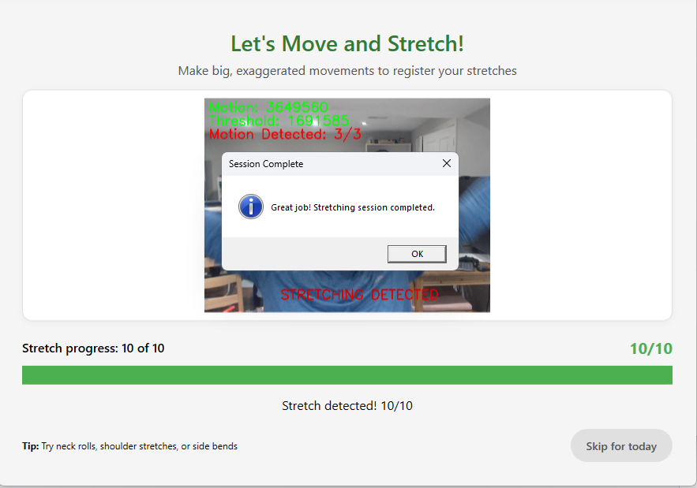

# Stretch Tracker App

A desktop application that reminds users to take regular stretching breaks and helps them maintain good physical health while working at a computer.

## Overview

Stretch Tracker App is a WPF (.NET) application that helps users prevent physical strain by providing timely reminders to stretch. The app uses computer vision and machine learning to detect stretching movements through the user's webcam, tracks progress, and maintains statistics about stretching habits over time.

## AI-Powered Movement Detection

{: .important-title }
> Advanced Computer Vision & Machine Learning
>
> What makes the Stretch Tracker App truly unique is its intelligent movement detection system. Using a powerful combination of computer vision and machine learning algorithms, the app can accurately verify when you're performing stretches.

The application uses two complementary technologies for movement detection:

### OpenCvSharp4

{: .highlight }
> **Computer Vision Technology**
>
> Real-time video frame analysis that can detect and quantify your movements with precision, distinguishing intentional stretches from normal activity.

Our primary motion detection system uses **OpenCvSharp4**, a powerful .NET wrapper for OpenCV, to implement:

- Frame-by-frame comparison to detect movements
- Adaptive threshold algorithms that adjust to your environment
- Morphological operations to filter out minor movements
- Automatic calibration to work in various lighting conditions

### TensorFlow.NET

{: .highlight }
> **Machine Learning Technology**
>
> Neural network-based pose estimation that recognizes specific body positions and movement patterns associated with effective stretching.

We're enhancing our detection capabilities with **TensorFlow.NET** for advanced pose estimation:

- Human pose detection to identify key body points
- Specific stretch recognition for more accurate movement analysis
- Quality assessment of your stretching movements
- Personalized feedback on stretching form

## Key Features

- **Customizable Reminder Intervals**: Set reminders from minutes to hours based on your needs
- **Computer Vision Detection**: Uses webcam and motion detection to verify stretching movements
- **Machine Learning Integration**: TensorFlow.NET for pose detection and stretching verification
- **Progress Tracking**: Records and displays stretching streaks and completion rates
- **Statistics Dashboard**: Visual representation of your stretching history and habits
- **Minimal Distraction**: Simple notifications that don't interrupt your workflow
- **System Tray Integration**: Runs in the background with system tray access

[Get Started](getting-started){: .btn .btn-primary .fs-5 .mb-4 .mb-md-0 .mr-2 }
[View on GitHub](https://github.com/nitin27may/StretchTracke){: .btn .fs-5 .mb-4 .mb-md-0 }